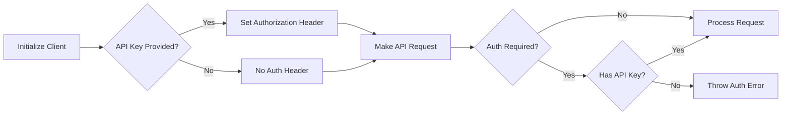

## Overview

The Axion SDK uses API key authentication to secure access to financial data endpoints. This guide covers how to obtain, configure, and manage your API keys.

## Getting Your API Key

<Steps>
  <Step title="Sign up for an account">
    Visit the Axion platform and create an account to get started.
  </Step>
  
  <Step title="Generate an API key">
    Navigate to your account dashboard and generate a new API key for your application.
  </Step>
  
  <Step title="Copy and store securely">
    Save your API key in a secure location. You'll need it to initialize the SDK client.
    
    <Warning>
      Never commit API keys to version control or share them publicly. Treat them like passwords.
    </Warning>
  </Step>
</Steps>

## Basic Authentication

Initialize the Axion client with your API key:

<CodeGroup>

```javascript JavaScript
import { Axion } from '@axionquant/sdk';

const client = new Axion('your-api-key-here');
```

```typescript TypeScript
import { Axion } from '@axionquant/sdk';

const apiKey: string = 'your-api-key-here';
const client: Axion = new Axion(apiKey);
```

</CodeGroup>

When you provide an API key during initialization, the SDK automatically:

1. Adds an `Authorization` header to all requests
2. Uses the format: `Bearer your-api-key-here`
3. Validates authentication before making requests

## Environment Variables

The recommended approach is to store your API key in environment variables:

<Steps>
  <Step title="Create a .env file">
    Create a `.env` file in your project root:
    
    ```bash .env
    AXION_API_KEY=your-api-key-here
    ```
  </Step>
  
  <Step title="Add .env to .gitignore">
    Ensure your `.env` file is not committed to version control:
    
    ```bash .gitignore
    .env
    .env.local
    .env.*.local
    ```
  </Step>
  
  <Step title="Load environment variables">
    Use a package like `dotenv` to load environment variables:
    
    ```bash
    npm install dotenv
    ```
  </Step>
  
  <Step title="Initialize the client">
    Access the API key from environment variables:
    
    ```javascript
    import 'dotenv/config';
    import { Axion } from '@axionquant/sdk';
    
    const client = new Axion(process.env.AXION_API_KEY);
    ```
  </Step>
</Steps>

## Authentication Flow

Here's how the SDK handles authentication internally:



## Authentication Requirements

The SDK automatically determines whether authentication is required for each endpoint:

<CodeGroup>

```javascript Authenticated Endpoints
// These endpoints require an API key
const stock = await client.stocks.ticker('AAPL');
const prices = await client.stocks.prices('AAPL');
const sentiment = await client.sentiment.all('AAPL');
const financials = await client.financials.metrics('AAPL');
```

```javascript Optional Authentication
// Some endpoints may work without authentication
// but have rate limits or reduced functionality
const client = new Axion(); // No API key

// This may work with limited access
const news = await client.news.general();
```

</CodeGroup>

<Note>
  Most endpoints require authentication. When an API key is required but not provided, the SDK throws an error: `"Authentication required but no API key provided to client."`
</Note>

## Error Handling

The SDK provides clear error messages for authentication issues:

```javascript
import { Axion } from '@axionquant/sdk';

const client = new Axion(); // No API key

try {
  const stock = await client.stocks.ticker('AAPL');
} catch (error) {
  if (error.message.includes('Authentication required')) {
    console.error('Please provide an API key');
    console.error('Initialize with: new Axion("your-api-key")');
  }
}
```

### Common Authentication Errors

<ResponseField name="Authentication required but no API key provided to client" type="error">
  **Cause:** Trying to access an authenticated endpoint without providing an API key.
  
  **Solution:** Initialize the client with your API key: `new Axion('your-api-key')`
</ResponseField>

<ResponseField name="HTTP Error 401: Unauthorized" type="error">
  **Cause:** Invalid or expired API key.
  
  **Solution:** Verify your API key is correct and hasn't been revoked. Generate a new key if needed.
</ResponseField>

<ResponseField name="HTTP Error 403: Forbidden" type="error">
  **Cause:** Valid API key but insufficient permissions for the requested resource.
  
  **Solution:** Check your account permissions or upgrade your plan.
</ResponseField>

## Security Best Practices

<AccordionGroup>
  <Accordion title="Use Environment Variables">
    Always store API keys in environment variables, never hardcode them:
    
    ```javascript
    // Good
    const client = new Axion(process.env.AXION_API_KEY);
    
    // Bad - never do this!
    const client = new Axion('sk_live_1234567890');
    ```
  </Accordion>
  
  <Accordion title="Separate Keys for Development and Production">
    Use different API keys for development, staging, and production environments:
    
    ```javascript
    const apiKey = process.env.NODE_ENV === 'production'
      ? process.env.AXION_API_KEY_PROD
      : process.env.AXION_API_KEY_DEV;
    
    const client = new Axion(apiKey);
    ```
  </Accordion>
  
  <Accordion title="Rotate Keys Regularly">
    Periodically rotate your API keys to maintain security:
    
    1. Generate a new API key
    2. Update your application's environment variables
    3. Deploy the changes
    4. Revoke the old API key
  </Accordion>
  
  <Accordion title="Monitor API Key Usage">
    Keep track of:
    - Request volume per API key
    - Unusual access patterns
    - Failed authentication attempts
    - Geographic origin of requests
  </Accordion>
  
  <Accordion title="Restrict Key Permissions">
    If the platform supports it, create API keys with limited scopes:
    - Read-only keys for data retrieval
    - Separate keys for different services
    - Time-limited keys for temporary access
  </Accordion>
</AccordionGroup>

## Advanced Configuration

### Custom Headers

The SDK automatically manages the Authorization header, but you can access the underlying axios client for advanced configuration:

```javascript
import { Axion } from '@axionquant/sdk';

const client = new Axion('your-api-key');

// The Authorization header is automatically set to:
// Authorization: Bearer your-api-key
```

### Multiple Clients

You can create multiple client instances with different API keys:

```javascript
const clientProd = new Axion(process.env.AXION_API_KEY_PROD);
const clientDev = new Axion(process.env.AXION_API_KEY_DEV);

// Use different clients for different purposes
const prodData = await clientProd.stocks.ticker('AAPL');
const devData = await clientDev.stocks.ticker('TEST');
```

## Testing Without Authentication

For development and testing with a local server that doesn't require authentication:

```javascript
// Initialize without an API key
const client = new Axion();

// Only works if your test server doesn't require auth
try {
  const data = await client.stocks.ticker('AAPL');
  console.log('Test data:', data);
} catch (error) {
  if (error.message.includes('Authentication required')) {
    console.log('This endpoint requires authentication');
  }
}
```

<Warning>
  This approach only works with endpoints that explicitly don't require authentication or when testing against a local development server.
</Warning>

## Authentication Source Code

Here's how authentication is implemented in the SDK (from src/index.ts:389-400, 422-435):

```typescript
class Axion {
  private apiKey?: string;
  
  constructor(apiKey?: string) {
    this.apiKey = apiKey;
    this.client = axios.create({
      baseURL: BASE_URL,
      headers: { "Content-Type": "application/json" }
    });
    
    if (apiKey) {
      this.client.defaults.headers.common["Authorization"] = `Bearer ${this.apiKey}`;
    }
  }
  
  async _request(method, path, params, data, authRequired = true) {
    if (!authRequired) {
      delete config.headers["Authorization"];
    } else if (authRequired && !this.apiKey) {
      throw new Error("Authentication required but no API key provided to client.");
    }
    // ... make request
  }
}
```

## Next Steps

<CardGroup cols={2}>
  <Card
    title="Quick Start Guide"
    icon="rocket"
    href="/quickstart"
  >
    Start building with authenticated API requests
  </Card>
  <Card
    title="API Reference"
    icon="book"
    href="/reference/client"
  >
    Explore all available endpoints
  </Card>
  <Card
    title="Error Handling"
    icon="triangle-exclamation"
    href="/error-handling"
  >
    Learn how to handle authentication errors
  </Card>
  <Card
    title="FAQ"
    icon="question"
    href="/faq"
  >
    Common questions about API usage
  </Card>
</CardGroup>
